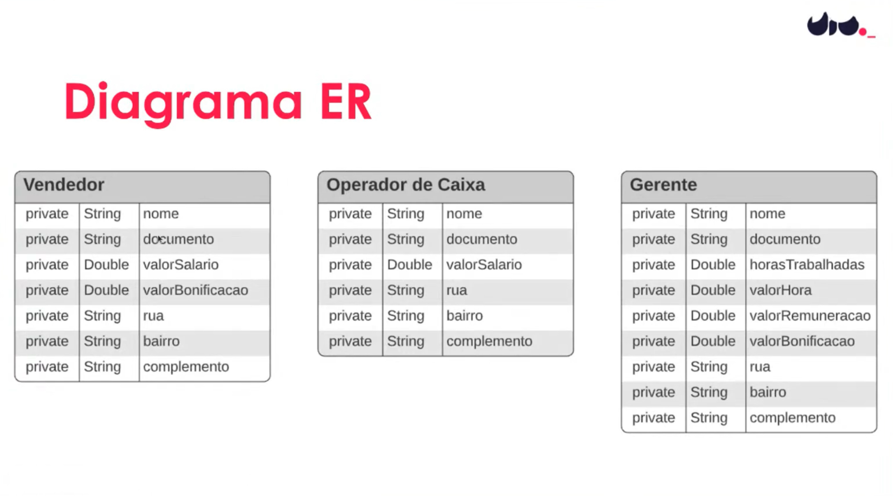
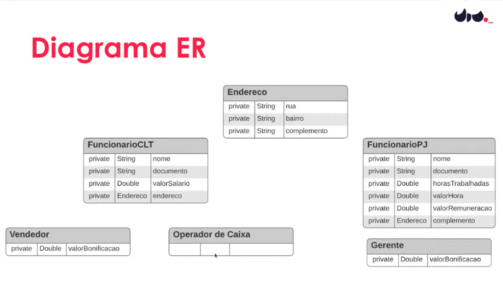

# Modelar as entidades de uma aplicação de Gerenciamento de Colaboradores de uma loja.
Dentre as outras funcionalidades (as quais você não precisará implementar), esse sistema terá a funcionalidade de calcular a bonificação dos colaboradores dessa loja seguindo as seguintes regras:

Vendedor é um Funcionário CLT e tem o benefício de bonificação.
Operador de Caixa é um funcionário CLT, mas não tem o benefício da bonificação.
Gerente é um Funcionário PJ e tem o benefício da bonificação.

## Colaboradores

### Vendedor:
nome, documento, salario, valor da bonificação e endereço.
### Operador de Caixa:
nnome, documento, salario e endereço.
### Gerente:
nome, documento, horas trabalhadas, valorHora, endereço e valor da bonificação.

## Paradigma de Programação Orientado a Objetos (POO)

A visão de Orientação a Objetos (OO) é aquela de um mundo de objetos que interagem.
Este paradigma é um modelo de análise, projeto e programação baseado na aproximação entre o mundo real e o mundo virtual, através da criação e interação entre classes, atributos, métodos, objetos, entre outros.
A observação do mundo real compõe o princípio da ABSTRAÇÃO, sendo considerada a base da Orientação a Objetos.
São 4 os pilares principais do POO: ENCAPSULAMENTO, HERANÇA, COMPOSIÇÃO E POLIMORFISMO.

🔺 ENCAPSULAMENTO:
Encapsular significa esconder a implementação dos objetos. O encapsulamento favorece principalmente dois aspectos de um sistema: a manutenção e a evolução.

🔺 HERANÇA:
Permite que objetos sejam referenciados como pai e filhos, em que os objetos filhos herdam todas as características do objeto pai, mas o objeto pai nada herda do filho. Isso reduz a duplicação de código-fonte.

🔺 COMPOSIÇÃO:
Busca representar as relações que os objetos devem ter, baseando-se nas relações que existem na vida real. Isso faz com que os objetos sejam reaproveitados, evitando duplicidade e mantendo a simplicidade.

🔺 POLIMORFISMO:
Com o polimorfismo, podemos transformar objetos diferentes em objetos que conseguem trocar mensagem por meio da generalização de suas características.

## CONCEITOS FUNDAMENTAIS POO 

🔻 DOMÍNIO:
Domínio da aplicação, também conhecida como camada de negócio ou de objetos de negócio, é aquela onde estão localizadas as classes que fazem parte do domínio do problema, ou seja, classes correspondentes a objetos que fazem parte da descrição do problema.

🔻 CLASSE:
Um elemento do código que tem a função de representar objetos do mundo real. Dentro dela é comum declararmos atributos e métodos, que representam, respectivamente, as características e comportamentos desse objeto.

🔻 ATRIBUTO:
Atributos são, basicamente, a estrutura de dados que vai representar a classe. Os atributos também são conhecidos como VARIÁVEL DE CLASSE, e podem ser divididos em dois tipos básicos: atributos de instância e de classe.

🔻 VARIÁVEL:
Uma “região de memória (do computador) previamente identificada cuja finalidade é armazenar os dados ou informações de um programa por um determinado espaço de tempo”.

🔻 MÉTODO:
Os métodos representam os estados e ações dos objetos e classes.

🔻 OBJETO:
Em POO, objeto é um "molde" de uma determinada classe, que passa a existir a partir de uma instância da classe. A classe define o comportamento do objeto, usando atributos (propriedades) e métodos (ações). Objeto em ciência da computação, é uma referência a um local da memória que possui um valor. Um objeto pode ser uma variável, função, ou estrutura de dados.

🔻 INSTÂNCIA:
Uma instância de uma classe é um novo objeto criado dessa classe, com o operador new. Instanciar uma classe é criar um novo objeto do mesmo tipo dessa classe. Uma classe somente poderá ser utilizada após ser instanciada.

Repositório criado para acompanhar mentoria da DIO com Camila da DIO.

Texto do README de autoria de Camila Cavalcante : https://github.com/cami-la/mentoria-GFT-START-4-030322
